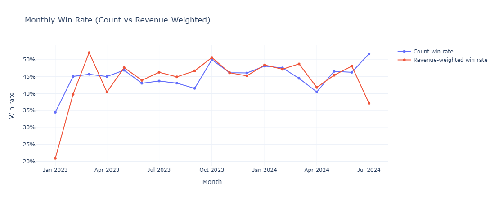
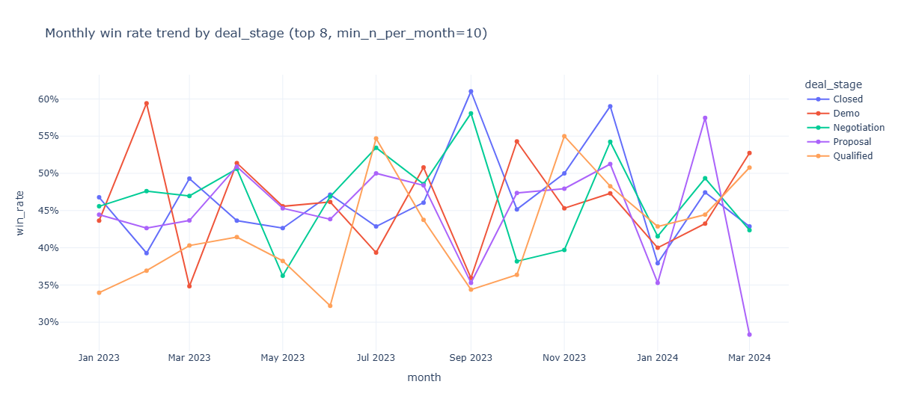
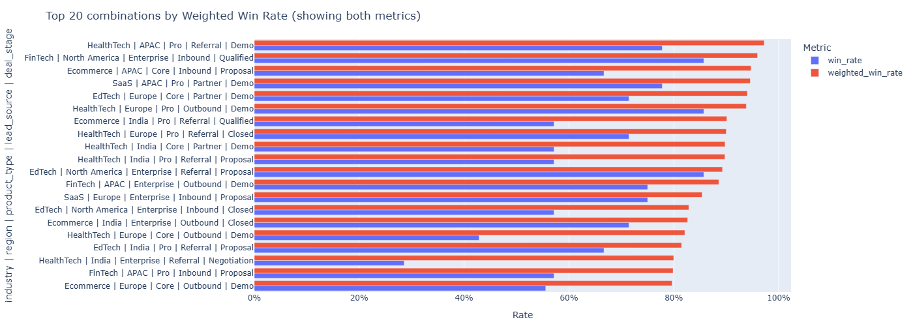
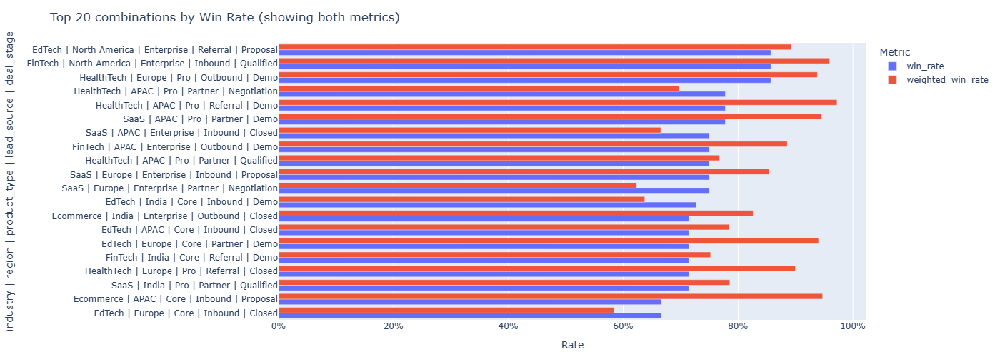

# SkyGeni – Sales Intelligence Challenge

---

## Part 1 - Problem Framing

### Real Bussiness Problems

Did win rate fall because we are selling to a different mix of deals, or because our conversion within the same mix got worse and which specific segment/stage/rep contributes most? And because of this, Are we losing bigger deals now?

### Key Questions AI System Answers

1. By how much did win rate change in the current quarters compared to previous quater & same 1 quarter from 1 year before.
2. Which segments[industry / region / product_type / lead_source / deal_stage] contributed most to the decline?
3. Which combinations of segments gave the better win rate with higher deval amount ?
4. Which segment[industry / region / product_type / lead_source / deal_stage] we should focus on and depriortize others for better win rate with best deal amount ?
5. Which sales representive has the lowest win rate ?
6. Which deals are “at risk” because their sales_cycle_days already exceeds typical winning cycle for similar deals?

## Metrics For Diagnosing Problem

- Revenue weighted win rate: ```sum(deal_amount * outcome) / sum(deal_amount)```

- Win rate (count-based): ```number of wins / closed_deals```

- Stage-level win rate: ```number of wins in specific stage / Total Number of deals in respective stage```
- Segment level win rate: ```number of wins in specific segment / Total Number of deals in respective segment```
  - Industry level win rate
  - Region level win rate
  - Product type level win rate
  - Lead source level win rate

- Win rate by deal_amount bands[small, mid, large]: ```number of wins in specific band / Total Number of deals in respective band```

- Gap between top and bottom sale representive win rates.

### Assumptions

1. The quality of the pipeline may be reduced even though the incoming numbers of pipeline remains same.
2. The definition of “won/lost” or deal stages may be changed.
3. The win rate may be reduced in the last quaters may be because of drop in sepecific regions, industries, product_type, lead_source, sales_rep_id not of overall.
4. The more deals may be stalled in some stage not moved forward to closed.
5. The sales_cycle_days may have increased that may leads to the lower conversion.
6. The win rate may be fallen more for some specific sales representives.
7. The win rate may be lower because the more focus on the high volumne deals so the deals won may leads more money even the win rate may be dropped.
8. May be there were were more new leads coming from of worst performing sectors of regions, industries, product_type, lead_source.
9. The win rate has drop over the last two quarters may be a repeated seasonal pattern.

## Part 2 - Data Exploration & Insights

### Exploratory Data Analysis

Here is the script of analsis ```/notebooks/eda.ipynb```. You can see the visualizations & the explanations. Also visualiztion are saved in the dir [`/notebooks/insight_images`](./notebooks/insight_images) 

### Insight Highlights & Metric Highlights

1. The deal amount weighted dropped even more than win rate.  
   

2. The deals that are stalled in the propostal stage got a very low win rate.
   

3. There were no seasonal patterns on the win rate for the deals.

4. Which combination of segments has the best win rates.
    - Segment Combinations by Weighted Win Rate
   

    - Segment Combinations by Win Rate
   

5. There are certain sales representives having higher win rates.
6. And there are many more insights in the eda file. Can see from the visualization plot.

## Part 3 - Build a Decision Engine

### Deal Risk Scoring

> **Code Reference:** All preprocessing, training, and inference code lives under the [`/src`](./src) directory.  
> For the detailed training + inference workflow and how to use the risk score in the system, refer to [`/src/README.md`](./src/README.md).

## Part 4 - Mini System Design

### Objective

Build a lightweight system that converts CRM deal activity into:

- Deal Risk Scores (probability of winning; low score = high loss risk)
- Stage stall alerts and lifecycle breach alerts
- Monthly segment performance insights (win rate + weighted win rate)
- Sales rep performance insights for CRO action.

### Use Cases

1. Once the new deal is created in the system, We will use Deal Risk Scoring model to calculate the risk of losing this deal.
2. Also whenver the deal stage is updated will re predict the Deal Risk Scoring.
3. Will send the alert if the deal is stalling in specific stage or crossing the median sales life cycle of the given deal segment.
4. Also for every month, we will calculate the weighted win rate metrics for all the segments so the CRO can priortize & de priortize the better win rate & low win rate segments respectively.
5. Will show the lowest performing sales representatives so that the CRO can take the necessary actions to upskill the respecitve sales rep

### High-level architecture

#### Components

1. **CRM / Deal Data Source**
Deals, stages, amounts, owners, created dates, close dates, segments (industry/region/product_type/lead_source)

2. **Event Listener / Scheduler Captures events**
deal_created, stage_updated, close_date_changed, etc. Or runs periodic sync if events aren’t available

3. **Model Scoring Service (XGBoost)**
Returns p_win ∈ [0,1]
Stores score.

4. **Rules + Alert Engine**
Stall checks, median lifecycle thresholds per segment, score drop thresholds.
Alert de-duplication + cooldown window to avoid alert fatigue

5. **Insights Aggregator**
Monthly segment weighted win rate
Rep performance metrics & ranking

6. **Storage Layer**
Sql DB: deals, deal_snapshots, deal_features, deal_scores, alerts, segments_metrics, rep_metrics

7. **Delivery & UI**
    - Slack/Teams/email notification
    - Web dashboard / CRM widget
    - Deal risk board (score + drivers)
    - Segment performance view
    - Rep performance view

### How often it runs

#### Event-driven scoring

- On deal_created --> score immediately
- On stage_updated --> rescore immediately

#### Daily batch jobs

- Stall detection across all open deals
- Lifecycle breach evaluation
- Sending the alerts / notification.

### Monthly jobs

- Segment metrics (win_rate + weighted_win_rate)

## Failure & Limitation

1. Model drift over time as the system will keep improving from the feedback from the system so score calibration can degrade (requires monitoring/retraining)

2. Low-sample segments/reps then leads to misleading rankings (need minimum deals filter)

## Part 5 - Reflection

### What would break in real-world production

- If the Process changes (new pricing, GTM strategy, new qualification rules) then the model drift and segment baselines become outdated.
- Representives comparisons become unfair if territory/lead quality varies

### Weakest assumptions

- The seasonal pattern needs multiple years of history to confirm. With only a few quarters, it may leads to weak insight.

### What I build next in 1 month

Will start building the system that I mentioned above.


